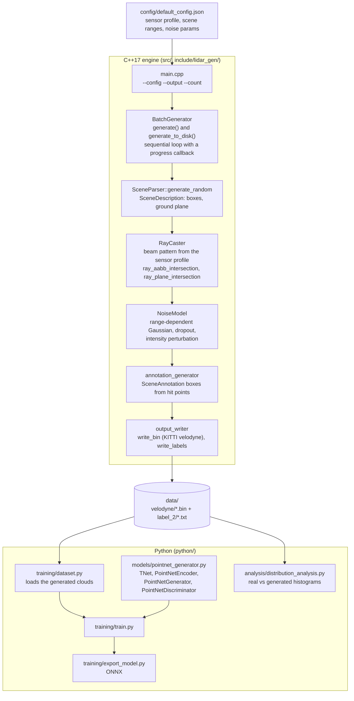
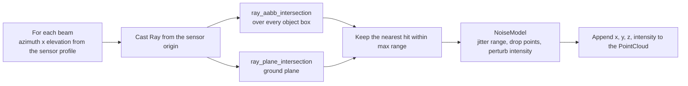

# LiDAR Forge

C++17 LiDAR point cloud synthesis pipeline with PointNet-based generative model for augmenting autonomous driving datasets.

## Architecture



Ray casting is the hot inner loop: every beam in the sensor profile is tested
against each scene AABB and the ground plane, the nearest hit wins, and the
surviving points are then perturbed by the noise model.



## Overview

- **Ray-cast engine** — beam-accurate simulation from configurable sensor parameters (64-beam Velodyne HDL-64E profile), AABB intersection, ground-plane intersection
- **Physics-grounded noise** — range-dependent Gaussian noise, random dropout, intensity perturbation
- **Batch generation** — sequential scene loop with JSON scene descriptions and KITTI binary output (`generate_to_disk` reports progress through a callback)
- **PointNet GAN** — conditional generator trained on real scans; exports to ONNX
- **Distribution analysis** — point density, range, and intensity histograms comparing real vs generated clouds

## Tech Stack

C++17 · Eigen3 · nlohmann/json · Python 3.11 · PyTorch · ONNX Runtime · CMake · Google Test

## Quickstart

```bash
# Build C++ engine
mkdir build && cd build
cmake .. -DCMAKE_BUILD_TYPE=Release
make -j$(nproc)

# Generate dataset
./lidar_generator --config ../config/default_config.json --output ./data --count 1000

# Train PointNet generator
pip install -r requirements.txt
python -m python.training.train --data_dir ./data --epochs 50

# Export to ONNX
python -m python.training.export_model --checkpoint checkpoints/best_generator.pt

# Analyse distributions
python -m python.analysis.distribution_analysis --real_dir ./real_data/velodyne --gen_dir ./data/velodyne
```

## Test

C++ unit tests (Google Test) cover the ray caster, noise model, and annotation
generator:

```bash
cd build
ctest --output-on-failure
# or:
./tests/test_ray_caster
./tests/test_noise_model
./tests/test_annotation
```

End-to-end smoke test:

```bash
./build/lidar_generator --config config/default_config.json --output /tmp/lf --count 10
ls /tmp/lf/velodyne/*.bin /tmp/lf/labels/*.json | wc -l   # expect 20
```

## Evaluation

`python/analysis/distribution_analysis.py` compares generated point clouds
against a held-out real KITTI split. Run after exporting a generator
checkpoint:

```bash
python -m python.analysis.distribution_analysis \
  --real_dir ./real_data/velodyne \
  --gen_dir  ./data/velodyne \
  --out      ./reports/distribution.json
```

Metrics reported:

| Task | Metric | Where |
|------|--------|-------|
| Generative fidelity | Chamfer distance, Earth Mover's Distance between real and generated clouds | `distribution_analysis.py` |
| Distributional match | KL / Jensen-Shannon divergence over per-point range, intensity, and density histograms | `distribution_analysis.py` |
| Coverage | minimum-matching-distance (MMD) and coverage (COV) across the test split | `distribution_analysis.py` |
| Annotation quality (detection on augmented set) | mAP@IoU=0.5 / 0.7 on a downstream PointNet/PointPillars detector trained with vs. without synthetic data | external; feed `data/labels/*.json` + `data/velodyne/*.bin` into a KITTI-format detector |
| Sensor realism | per-beam dropout rate and range-noise stddev vs. real scans | `distribution_analysis.py` |

## Architecture

```
SceneParser → generate_random()       # random road scene with N objects
    → RayCaster::cast()               # 64×360 beam scan, AABB + ground hits
    → NoiseModel::apply()             # range noise, dropout, intensity jitter
    → generate_annotations()          # per-point labels + 3D bounding boxes
    → write_bin() / write_labels()    # KITTI .bin + JSON
    → PointNetGenerator (PyTorch GAN) # learn real-scan distribution
    → ONNX export                     # deploy in C++
```

## Project Structure

```
lidar_forge/
├── include/lidar_gen/   # Public C++ headers
├── src/                 # C++ implementation + CMakeLists.txt
├── tests/               # Google Test suite
├── python/
│   ├── models/          # PointNetGenerator, PointNetDiscriminator
│   ├── training/        # train.py, export_model.py, dataset.py
│   └── analysis/        # distribution_analysis.py
└── config/              # default_config.json
```
